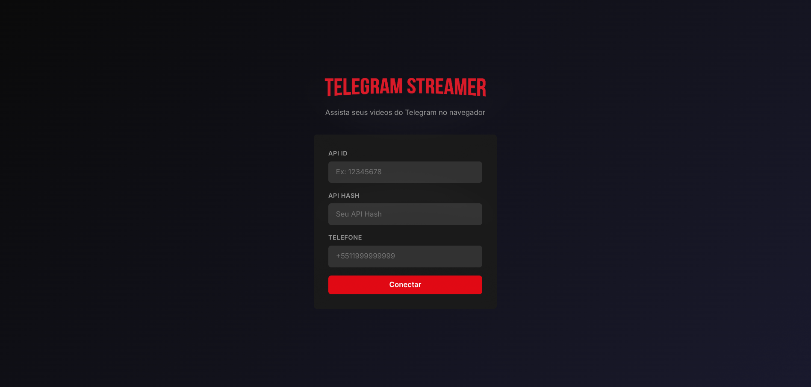
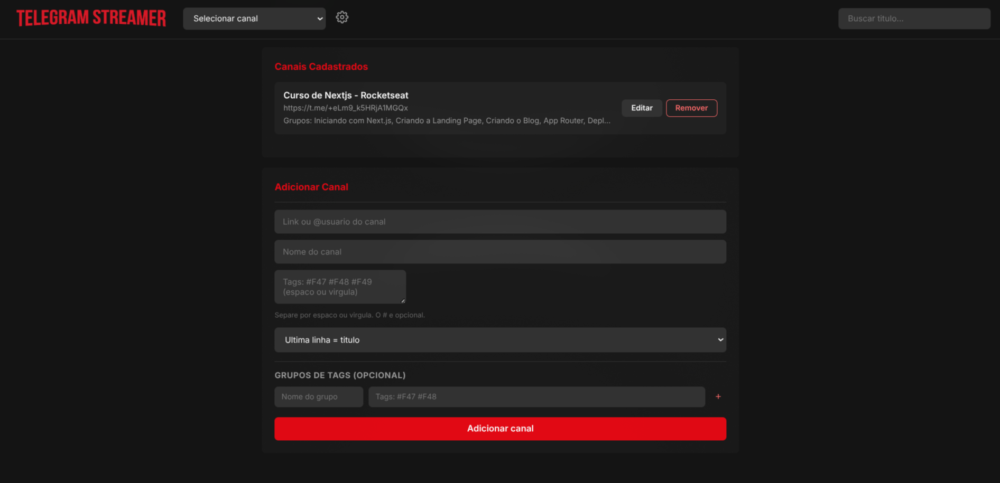
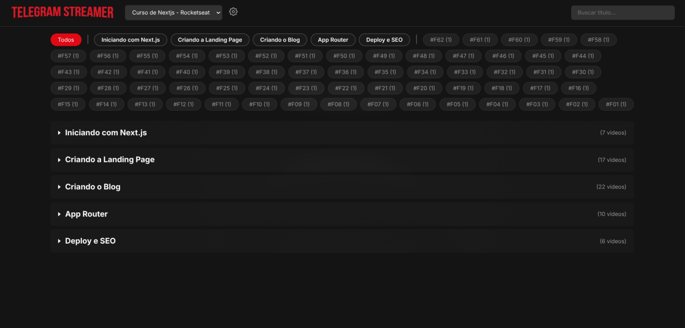

<p align="center">
  
</p>

<h3 align="center">Assista seus videos do Telegram diretamente no navegador</h3>

## Funcionalidades

- **Streaming direto** — videos sao reproduzidos do Telegram sem download, com suporte a Range requests (seek/progressivo)
- **Thumbnails** — miniaturas geradas automaticamente dos videos
- **Canais** — suporta multiplos canais, incluindo links de convite (`t.me/+hash`)
- **Tag groups** — organize videos em grupos com nome (ex: "Iniciando com Next.js", "App Router")
- **Filtros** — filtre por grupo, por tag individual, ou busque por titulo
- **Sessao compartilhada** — reutiliza a sessao do Telegram-Downloader-Tools
- **2FA** — suporte completo a autenticacao em duas etapas
- **Cache** — videos sao cacheados por 5 minutos, eliminando escaneamentos repetidos
- **Responsivo** — layout adaptavel para desktop, tablet e mobile

## Stack

- **Backend:** Python 3.14, FastAPI, Telethon, Uvicorn
- **Frontend:** HTML/CSS/JS vanilla (sem framework)
- **Tema:** Netflix dark

## Instalacao

```bash
# Clonar o repositorio
git clone https://github.com/vinicius-dsr/telegram-streamer.git
cd telegram-streamer

# Criar e ativar venv
python3 -m venv .venv
source .venv/bin/activate

# Instalar dependencias
pip install -r requirements.txt

# Executar
python main.py
```

O servidor inicia em `http://0.0.0.0:8000`.

## Configuracao

Na primeira execucao, voce precisara:

1. Obter `API ID` e `API Hash` em [my.telegram.org](https://my.telegram.org)
2. Informar seu numero de telefone
3. Inserir o codigo de verificacao recebido pelo Telegram

Os dados sao salvos em `config.json`.

<p align="center">
   
</p>

### Canais

Adicione canais pela tela de Configuracoes:

- **Link direto:** `https://t.me/nome_do_canal`
- **Link de convite:** `https://t.me/+hash_do_convite`
- **Username:** `@nome_do_canal`

### Tags e Grupos

Formato de entrada (aceita espacos ou virgulas):
```
#F01 #F02 #F03 #F04
```

Grupos permitem organizar videos por secao com titulo, exibidos como dropdowns na tela principal.

<p align="center">
   
</p>

<p align="center">
   
</p>

## Estrutura

```
Telegram-Streamer/
├── main.py                 # Entrada do FastAPI
├── core/
│   ├── config_manager.py   # Gerenciamento de config.json
│   ├── telegram_client.py  # Wrapper do Telethon
│   └── video_service.py    # Logica de videos, streaming e cache
├── routes/
│   ├── api.py              # Endpoints REST
│   └── auth.py             # Endpoints de autenticacao
├── static/
│   ├── css/style.css       # Tema Netflix dark
│   └── js/
│       ├── api.js          # Cliente HTTP
│       ├── app.js          # Logica frontend
│       └── player.js       # Player de video
└── templates/
    └── index.html          # SPA principal
```

## API

| Endpoint | Metodo | Descricao |
|---|---|---|
| `/api/auth/status` | GET | Status da conexao |
| `/api/auth/login` | POST | Login com API ID/Hash |
| `/api/auth/code` | POST | Verificar codigo |
| `/api/auth/2fa` | POST | Verificar 2FA |
| `/api/auth/reuse` | POST | Reusar sessao do Downloader |
| `/api/channels` | GET | Listar canais |
| `/api/channel` | POST | Adicionar canal |
| `/api/channel/{id}` | PUT | Editar canal |
| `/api/channel/{id}` | DELETE | Remover canal |
| `/api/videos` | GET | Listar videos |
| `/api/video/{id}` | GET | Metadata de um video |
| `/api/stream/{id}` | GET | Streaming do video |
| `/api/thumbnail/{id}` | GET | Thumbnail do video |
| `/api/tags` | GET | Listar tags |


## Gostou do projeto? [Me pague um café](https://viniciusdev.site/coffee)

