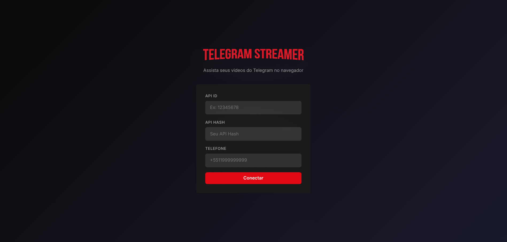
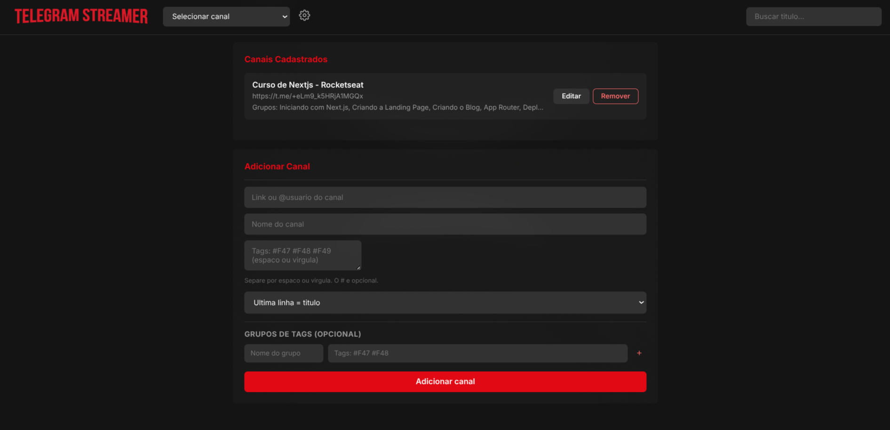
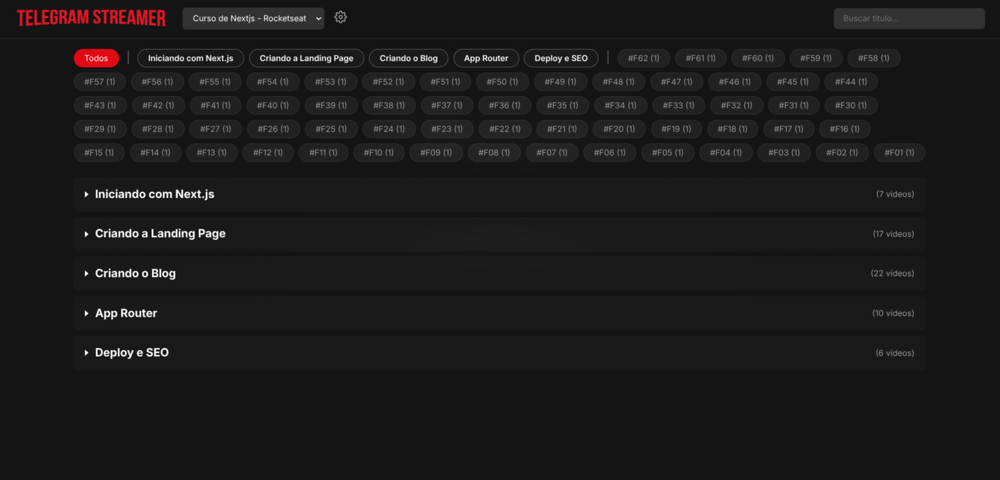

<p align="center">
  
</p>

<h3 align="center">Assista seus videos do Telegram diretamente no navegador</h3>

## Funcionalidades

- **Streaming direto** — videos sao reproduzidos do Telegram sem download, com suporte a Range requests (seek/progressivo)
- **Thumbnails** — miniaturas geradas automaticamente dos videos
- **Canais** — suporta multiplos canais, incluindo links de convite (`t.me/+hash`)
- **Segregacao por sumario** — detecta a mensagem de sumario do canal (`= modulo`, `== subtopico`, `#tags`) e agrupa os videos automaticamente em accordions de modulos/subtopicos
- **Sumarios multiplos** — mescla varias mensagens guia (fixada + continuacoes) em um unico indice, mesmo quando as tags de um modulo ficam na mensagem seguinte
- **Busca** — filtre videos por titulo ou caption
- **Sessao compartilhada** — reutiliza a sessao do Telegram-Downloader-Tools
- **2FA** — suporte completo a autenticacao em duas etapas
- **Cache** — videos sao cacheados por 5 minutos, eliminando escaneamentos repetidos
- **Player ArtPlayer.js** — player moderno com controles ricos: tela cheia (window/web), picture-in-picture, velocidade de reproducao, screenshot e proporcao de tela
- **Navegacao no player** — setas de anterior/proximo ao lado do player, seguindo a ordem dos dropdowns (modulo > subtopico), com indicacao da secao ao trocar de agrupamento
- **Auto-avancar** — ao terminar o video, a seta de proximo mostra o proximo titulo e uma contagem regressiva (10s) para avancar automaticamente; clicando antes pula direto
- **Retomar playback** — lembra onde voce parou de assistir e retoma automaticamente
- **Responsivo** — layout adaptavel para desktop, tablet e mobile

## Stack

- **Backend:** Python 3.14, FastAPI, Telethon, Uvicorn
- **Frontend:** HTML/CSS/JS vanilla (sem framework) + ArtPlayer.js
- **Tema:** Netflix dark

## Instalacao

```bash
# Clonar o repositorio
git clone https://github.com/vinicius-dsr/telegram-streamer.git
cd telegram-streamer

# Criar e ativar venv
python3 -m venv .venv
source .venv/bin/activate

# Instalar dependencias
pip install -r requirements.txt

# Executar
python main.py
```

O servidor inicia em `http://0.0.0.0:8000`.

## Configuracao

Na primeira execucao, voce precisara:

1. Obter `API ID` e `API Hash` em [my.telegram.org](https://my.telegram.org)
2. Informar seu numero de telefone
3. Inserir o codigo de verificacao recebido pelo Telegram

Os dados sao salvos em `config.json`.

<p align="center">
   
</p>

### Canais

Adicione canais pela tela de Configuracoes:

- **Link direto:** `https://t.me/nome_do_canal`
- **Link de convite:** `https://t.me/+hash_do_convite`
- **Username:** `@nome_do_canal`

### Sumario do canal (segregacao automatica)

Se o canal mantiver uma mensagem de sumario (fixada ou recente), os videos sao
agrupados automaticamente por modulo/subtopico em accordions:

```
= 01. Iniciando estudos
#F001 #F002 #F003

= 02. HTML
== 1_Formularios
#F007 #F008 #F009
== 2_Semantica
#F010 #F011
```

- Tags na linha do modulo (sem `==`) agrupam diretamente no modulo
- Diversas mensagens guia (ex.: fixada + continuacao) sao detectadas e mescladas;
  tags que iniciam a continuacao sao atribuidas ao ultimo modulo da mensagem anterior
- Videos sem tag correspondente caem na secao "Outros"
- O criterio minimo (2+ headings ou 3+ tags) evita que captions comuns sejam
  confundidos com sumario

<p align="center">
   
</p>

<p align="center">
    
</p>

## Demonstração

Assista a um exemplo de uso abaixo. O video foi gravado durante uma sessão real de streaming.

<p align="center">
  <a href="https://x8y84tt318.ufs.sh/f/P5hQbUHBvh3fGnWpJjzJcdCRh85otfZe7iWEK0BQsIOVDnrl">
    ▶ Clique aqui para assistir ao video demo
  </a>
</p>


## Estrutura

```
Telegram-Streamer/
├── main.py                 # Entrada do FastAPI
├── core/
│   ├── config_manager.py   # Gerenciamento de config.json
│   ├── telegram_client.py  # Wrapper do Telethon
│   └── video_service.py    # Logica de videos, streaming e cache
├── routes/
│   ├── api.py              # Endpoints REST
│   └── auth.py             # Endpoints de autenticacao
├── static/
│   ├── css/style.css       # Tema Netflix dark
│   └── js/
│       ├── api.js          # Cliente HTTP
│       ├── app.js          # Logica frontend
│       └── player.js       # Player de video
└── templates/
    └── index.html          # SPA principal
```

## API

| Endpoint | Metodo | Descricao |
|---|---|---|
| `/api/auth/status` | GET | Status da conexao |
| `/api/auth/login` | POST | Login com API ID/Hash |
| `/api/auth/code` | POST | Verificar codigo |
| `/api/auth/2fa` | POST | Verificar 2FA |
| `/api/auth/reuse` | POST | Reusar sessao do Downloader |
| `/api/channels` | GET | Listar canais |
| `/api/channel` | POST | Adicionar canal |
| `/api/channel/{id}` | PUT | Editar canal |
| `/api/channel/{id}` | DELETE | Remover canal |
| `/api/videos` | GET | Listar videos |
| `/api/video/{id}` | GET | Metadata de um video |
| `/api/stream/{id}` | GET | Streaming do video |
| `/api/thumbnail/{id}` | GET | Thumbnail do video |
| `/api/summary` | GET | Sumario do canal (modulos/subtopicos/tags) |
| `/api/prefetch/{id}` | GET | Pre-baixar inicio do video |
| `/api/progress/{id}` | GET | Obter posicao salva |
| `/api/progress/{id}` | POST | Salvar posicao atual |
| `/api/watched` | GET | Listar videos assistidos |
| `/api/watched/{id}` | POST | Alternar status de assistido |


## Gostou do projeto? [Me pague um café](https://viniciusdev.site/coffee)
